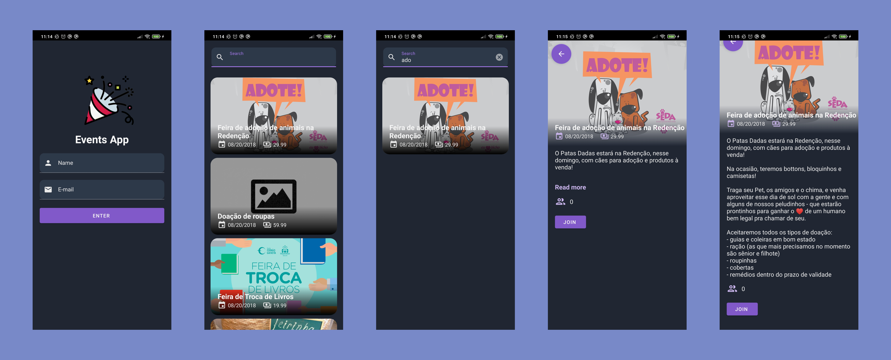
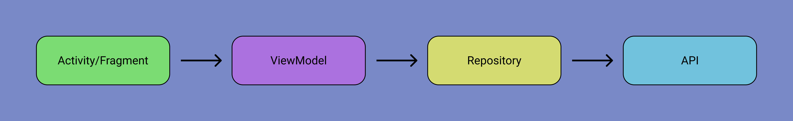

# Events App

If you want to take a better look in the screens of the App, they are [here](https://drive.google.com/drive/folders/1ssQviNmhYkwfkknuohyn0i7wpVaZK9a6?usp=sharing).

## About this project

An Android App to display events.

## User functionalities

- Events
  - Display 
  - Join
  - Search by event name

## Architecture
- As Google recommends, the architecture chosen was MVVM.

## Built With
- [Android SDK](https://developer.android.com/) - Create an Android App
- [Kotlin](https://developer.android.com/kotlin) - Develop Android apps with Kotlin
- [Coroutines](https://kotlinlang.org/docs/coroutines-overview.html) - Asynchronous or non-blocking programming
- [Retrofit](https://square.github.io/retrofit/) - A type-safe HTTP client for Android
- [Koin](https://insert-koin.io/) - Dependency injection
- [Material Design](https://material.io/develop/android/) - Material Components for Android
## License

This project is licensed under the MIT License - see the [LICENSE.md](https://github.com/diegoleonds/ScoreApp/blob/master/LICENSE) file for details
